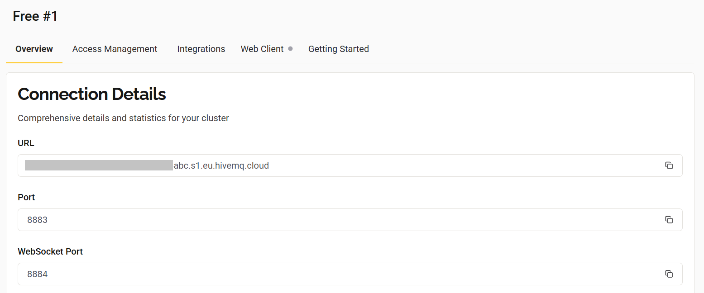

# Protocolo MQTT para IoT

Este repositório contém a implementação prática do protocolo MQTT (Message Queuing Telemetry Transport) aplicado a um ambiente de Internet das Coisas (IoT) utilizando a placa NodeMCU ESP-8266. O projeto envolve a comunicação entre sensores, atuadores e um broker em nuvem, demonstrando os princípios fundamentais de publicação e assinatura (publish/subscribe) em sistemas embarcados conectados à rede Wi-Fi. O desenvolvimento é destinado à colaboração com o projeto de conclusão de curso das alunas Dinalva e Kamila Gonçalvez 

## Dados pessoais
**Nome:** Marcio Salmazo Ramos \
**Redes sociais e contato:**

|  |  |  |  |
|---|---|---|---|

## Conceitos e introdução

O MQTT consiste em um protocolo de comunicação orientado à troca de mensagens em um modelo de publicação e assinatura (publish/subscribe), caracterizado por sua leveza e eficiência, sendo amplamente utilizado em sistemas com recursos computacionais limitados e conectividade instável ou de baixa largura de banda. O funcionamento do MQTT baseia-se na interação entre três componentes principais:

* ***Broker:*** entidade central responsável por receber as mensagens publicadas e encaminhá-las aos respectivos assinantes. Atua como mediador da comunicação entre os dispositivos conectados;
* **Clientes (*Clients*):** dispositivos ou aplicações que estabelecem conexão com o broker. Cada cliente pode simultaneamente publicar informações (publishers) e se inscrever para receber dados (subscribers);
* **Tópicos (*Topics*):** canais hierárquicos de comunicação utilizados para classificar e direcionar mensagens. Podem ser comparados à estrutura de diretórios de um sistema de arquivos, onde cada nível representa uma categoria ou subcategoria temática.

A operação do protocolo ocorre conforme as seguintes etapas:

1. **Conexão:** o cliente estabelece comunicação com o broker MQTT;
2. **Publicação:** um cliente atua como publisher e envia uma mensagem a um tópico específico (por exemplo: *sensor/temperatura/sala*);
3. **Assinatura:** outro cliente, configurado como subscriber, realiza a inscrição no tópico correspondente;
4. **Entrega:** o broker encaminha a mensagem recebida aos assinantes vinculados ao tópico, garantindo a distribuição da informação.
\
A adoção do MQTT se justifica por sua eficiência no uso de rede e processamento, graças ao cabeçalho reduzido e ao baixo consumo de recursos (ideal para dispositivos embarcados). Outro aspecto relevante é o desacoplamento entre *publishers* e *subscribers*, o que promove escalabilidade e flexibilidade arquitetural, uma vez que os dispositivos não necessitam reconhecer reciprocamente suas identidades para estabelecer comunicação.

## Objetivos e metodologia da atividade

Este projeto tem como objetivo principal implementar e analisar o funcionamento do protocolo MQTT no contexto da Internet das Coisas (IoT), empregando uma abordagem prática para promover o entendimento de sua arquitetura, operação e aplicação em ambientes embarcados. Além disso, busca-se a familiarização com o ambiente de desenvolvimento Arduino IDE, com a placa de prototipagem NodeMCU ESP8266 e com circuitos periféricos destinados à leitura de sensores e ao acionamento de atuadores.

**Objetivos específicos:**

- Demonstrar o uso do protocolo MQTT aplicado ao ESP-8266;
- Integrar sensores (LDR e HC-SR04) e atuadores (LED) ao microcontrolador;
- Realizar leitura, envio e controle remoto de dispositivos via MQTT;
- Empregar ferramentas como Arduino IDE, HiveMQ Cloud e MQTT Dash.

## Etapas de desenvolvimento

A partir dos objetivos citados, o desenvolvimento deste estudo foi estruturado nas seguintes etapas:

1. **Definição do escopo:** Utilizar a placa NodeMCU ESP8266, equipada nativamente com conectividade Wi-Fi, para estabelecer comunicação com um broker MQTT em nuvem. Para fins práticos de teste, foram integrados um LED e um sensor LDR (Light Dependent Resistor) ao microcontrolador. O LED é controlado remotamente por meio de mensagens publicadas (publish), enquanto os dados referentes à luminosidade captada pelo LDR são enviados como mensagens, permitindo sua leitura por assinantes (subscribers).

2. **Escolha e configuração do broker MQTT:** O HiveMQ Cloud foi selecionado como broker MQTT devido ao seu ambiente totalmente baseado em nuvem, o que facilita a implantação sem necessidade de manutenção direta de infraestrutura. A plataforma oferece escalabilidade, segurança integrada e um plano gratuito adequado para fins educacionais e de prototipagem, tornando-a alinhada ao propósito desta atividade.

3. **Configuração do ambiente de desenvolvimento:** A Arduino IDE foi escolhida como ferramenta de desenvolvimento por ser gratuita, multiplataforma e amplamente utilizada no ecossistema de prototipagem eletrônica. Sua interface simplificada e suporte nativo à família ESP8266 possibilitam escrever, compilar e enviar o código para a placa de forma acessível, favorecendo o aprendizado e a prática com microcontroladores.

4. **Configuração e integração do aplicativo MQTT Dash:** Para fins de monitoramento e interação com o dispositivo, utilizou-se o aplicativo MQTT Dash, que permite a criação de dashboards personalizados para visualização de dados e controle remoto de dispositivos IoT. Por meio dele, o sistema conecta-se ao broker e interage com os tópicos configurados, exibindo as medições de luminosidade do LDR e possibilitando o acionamento do LED diretamente pelo smartphone.

***Configurações principais:***

- Address → servidor MQTT
- Port → porta
- SSL/TLS habilitado
- Widgets configurados como publisher, subscriber ou ambos

## ⚙️ Pré-requisitos

- Arduino IDE: *https://www.arduino.cc/en/software/*
- Driver para a placa ESP-8266: *https://www.silabs.com/software-and-tools/usb-to-uart-bridge-vcp-drivers?tab=downloads* (baixar e instalar a opção *CP210x VCP Windows*)

**Observação:** A configurações de instalação do Arduino IDE devem ser mantidas no padrão e a instalação do driver é feita por meio do executável *CP210xVCPInstaller_x64* 

## ⚙️ Configuração do Arduíno IDE 

Após a instalação do ambiente de desenvolvimento e dos drivers necessários para reconhecimento da placa, torna-se necessário configurar o Arduino IDE para suportar o microcontrolador ESP8266, bem como instalar as bibliotecas indispensáveis para a comunicação Wi-Fi e para o uso do protocolo MQTT. A seguir, descrevem-se as etapas adotadas:

1. Na aba ***File*** selecionar a opção ***Preferences*** e inserir no campo ***Additional Boards Manager URLs*** o seguinte endereço: *https://arduino.esp8266.com/stable/package_esp8266com_index.json*. Após este procedimento, basta clicar no botão ***ok***.

2. Vá na aba ***Tools***, selecione a opção ***Board*** e em seguida a opção ***Boards Manager***. Na janela que abrir, busque por "esp8266" e instale o pacote resultante.

3. Vá na aba ***Sketch***, selecione a opção ***Include Library*** e em seguida a opção ***Manage Libraries*** procure pela biblioteca ***PubSubClient*** (por Nick O'Leary) e instale. Também é necessário a biblioteca ***ESP8266WiFi***, contudo ela vem com o pacote esp8266 por padrão.

## Descrição do diagrama eletrônico utilizado

O diagrama de circuito original (utilizando apenas o sensor de LDR e o LED) é exibido na imagem a baixo:

***OBSERVAÇÃO 1*** - O led é ligado no pino D1.\
***OBSERVAÇÃO 2*** - O valor do LDR é obtido por meio de um divisor de tensão e sua saída é ligada no pino analógico A0.

---

O diagrama de circuito utilizado para implentar apenas o sensor de proximidade (A fim de se familiarizar com a operação do mesmo) é exibido na imagem a baixo:

---

O diagrama de circuito utilizado para implentar  o sensor de proximidade ao ESP-8266, utilizando-se dos recursos concedido pelo protocolo MQTT é exibido na imagem a baixo:

***OBSERVAÇÃO 1*** - O ESP concede apenas 3.3V e em razão disso, é necessário que a alimentação do sensor seja feita por uma fonte externa que disponibilize 5V (Na imagem são utilizadas 3 pilhas apenas como representação).\
***OBSERVAÇÃO 2*** - O valor disparado pelo pino ECHO é de 5 volts, por isso, é necessário a implementação de um divisor de tensão, a fim de reduzir o sinal para 3.3v (Em conformidade com as especificações do NodeMCU).

## Configuração do broker MQTT (HiveMQ Cloud)

* O broker pode ser acessado por meio do seguinte link: *https://www.hivemq.com/products/mqtt-cloud-broker/*
* O usuário deve criar uma conta na plataforma (caso ainda não tenha) e selecionar a opção gratuita *'servless'*
* A página overview contém os dados do broker que precisam ser passados para o cóDigo no Arduino IDE, (conforme exibidos na imagem a baixo) sendo:\
    - URL -> mqtt_server (código)
    - Port -> mqtt_port (código)

## Parâmetros configuráveis no código

- ssid ->  Nome da rede WIFI
- password -> Senha da rede WIFI
- mqtt_server ->  URL do servidor MQTT
- mqtt_port -> Porta de conexão do broker MQTT
- mqtt_user -> Usuário do broker para autenticação
- mqtt_pass -> Senha do broker para autenticação

## Instalação e configuração do MQTT Dash

1. Fazer o download do app da *PlayStore* ou *AppStore*;
2. Ao entrar no aplicativo, clicar no icone '+' localizado no canto superior direito, definindo os seguintes parâmetros:
* ***Name*** -> Nome escolhido para a conexão (fica à critério do usuário);
* ***Adress*** -> Endereço do broker (o mesmo que o mqtt_server do código);
* ***Port*** -> Porta de operação do broker (o mesmo que o mqtt_port do código);
* ***User Name*** -> Usuário do broker para autenticação;
* ***User password*** -> Usuário do broker para autenticação;
* ***Client ID*** -> Identificador único do cliente do MQTT Dash (fica à critério do usuário).

***OBSERVAÇÃO:*** Marcar as todas as caixas relacionadas à criptografia SSL/TLS.

3. Salvar as configurações por meio do botão localizado no canto superior direito (ícone de disquete).
4. Conectar com o broker e inserir widgets. Os widgets são adicionados pelo icone '+' localizado no canto superior direito após a conexão com o broker. Existem diferentes tipos de widgets, voltados para aplicações específicas como switches, retorno de texto, barras de progresso, etc. 
- Ao escolher um widget, a principal configuração é a definição de inscrição ou publicação. Para leitura exclusiva de dados provenientes de sensores, deve ser definida apenas o tópico (sub). Para a ativação exclusiva de funções (por meio da publicação), é necessário marcar a opção *Enable publish* e inserir o nome do tópico correspondente.
5. Salvar a configuração do *widget* e averigar o seu comportamento.

## 🆕 Integração do sensor de proximidade HC-SR04

O sensor HC-SR04 é um módulo ultrassônico utilizado para medir distâncias com alta precisão, baseado no tempo de resposta do eco da onda sonora emitida. Embora o ESP-8266 possua algumas limitações de pinos, o HC-SR04 pode ser integrado com excelente desempenho.

1. ***Funcionamento do HC-SR04:*** O módulo possui quatro pinos:

- VCC → Alimentação
- GND → Terra
- TRIG → Pino de disparo
- ECHO → Pino de retorno

***O princípio é:***
- O ESP-8266 envia um pulso de 10 µs no pino TRIG;
- O HC-SR04 emite uma onda ultrassônica a 40 kHz;
- Ao detectar o retorno do sinal, o pino ECHO é ativado;
- O microcontrolador calcula a distância com base no tempo medido.

***OBSERVAÇÃO:*** O pino ECHO do HC-SR04 opera em 5V, enquanto o ESP-8266 aceita máx. 3.3V. É indispensável um divisor de tensão no retorno do ECHO (ex.: resistores 1kΩ + 2kΩ).

## 📡 Tópicos MQTT utilizados

| Função | Tópico | Descrição |
|-------|--------|----------|
| Publicação (LDR) | `sala/esp/ldr` | Envia o valor do sensor de luminosidade |
| Publicação (LED estado) | `sala/esp/led/status` | Informa estado atual do LED |
| Assinatura (controle LED) | `sala/esp/led/set` | Recebe comando para acender/apagar LED |
|Leitura do sensor de proximidade | `topic_proximity_sensor` | Envia o valor do sensor de proximidade

## ⚠️ Erros Comuns

| Erro | Causa provável | Solução |
|------|----------------|---------|
| ❌ Programa não carrega | Seleção errada de placa ou porta | Verifique ambos estão corretamente definidos na IDE |
| ❌ Falha de conexão | Parâmetros errados ou broker offline | Verificar disponibilidade do broker e os dados inseridos em código  |
| Wi-Fi não conecta | SSID/senha incorretos | Revisar credenciais
| Não envia dados ao broker | Conexão MQTT falhou | Conferir URL, porta, usuário e senha
| HC-SR04 instável | ECHO conectado sem divisor | Verificar divisor de tensão

---

## 🆕 Atualizações / Changelog

- **09/nov/2025**
  - Primeira iteraçao do projeto
  - Conecta-se ao WiFi e ao broker especificado
  - Realiza leitura contínua no pino A0 
  - Realiza leitura e escrita do pino D1

- Atual (versão revisada)

  - Documentação aprimorada
  - Estrutura padronizada
  - Seção adicionada: Integração do HC-SR0

---

## 👨‍💻 Autores / Contribuidores

- Dinalva
- Kamila Gonçalvez 
- Marcio Ramos

